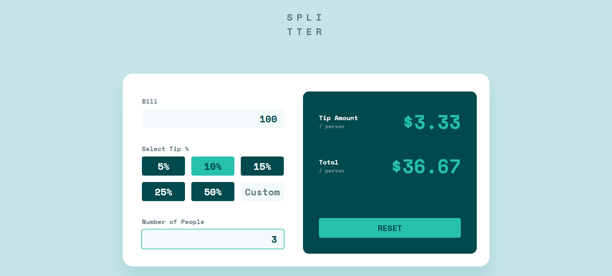

# Frontend Mentor - Tip calculator app solution

This is a solution to the [Tip calculator app challenge on Frontend Mentor](https://www.frontendmentor.io/challenges/tip-calculator-app-ugJNGbJUX). Frontend Mentor challenges help you improve your coding skills by building realistic projects.

## Table of contents

- [Overview](#overview)
  - [The challenge](#the-challenge)
  - [Screenshot](#screenshot)
  - [Links](#links)
- [My process](#my-process)
  - [Built with](#built-with)
  - [What I learned](#what-i-learned)
- [Author](#author)

## Overview

### The challenge

Users should be able to:

- View the optimal layout for the app depending on their device's screen size
- See hover states for all interactive elements on the page
- Calculate the correct tip and total cost of the bill per person

### Screenshot

### Links

- Solution URL: [https://github.com/nahuelcaputto/tip-calculator-app](https://github.com/nahuelcaputto/tip-calculator-app)
- Live Site URL: [https://nahuelcaputto.github.io/tip-calculator-app/](https://nahuelcaputto.github.io/tip-calculator-app/)

## My process

### Built with

- Semantic HTML5 markup
- CSS custom properties
- Flexbox
- CSS Grid
- Mobile-first workflow
- [React](https://reactjs.org/) - JS library
- [Vite](https://vitejs.dev/) - Frontend build tool
- [Tailwind CSS](https://tailwindcss.com/) - Utility-first CSS framework

### What I learned

This project was my second experience using **Vite** as a build tool, which enabled a fast development server, efficient hot module replacement, and a streamlined configuration workflow.

I worked extensively with **React** and **Tailwind CSS**, reinforcing a component-based architecture and applying responsive, utility-first styling to closely match the intended design.

Finally, I implemented unit and component tests using **Jest** and **React Testing Library**, strengthening my understanding of testable component design, user-centric testing practices, and overall application reliability.

## Author

- Github - [Nahuel Caputto](https://github.com/nahuelcaputto)
- Frontend Mentor - [@nahuelcaputto](https://www.frontendmentor.io/profile/nahuelcaputto)
- LinkedIn - [@nahuel-caputto](https://www.linkedin.com/in/nahuel-caputto/)
